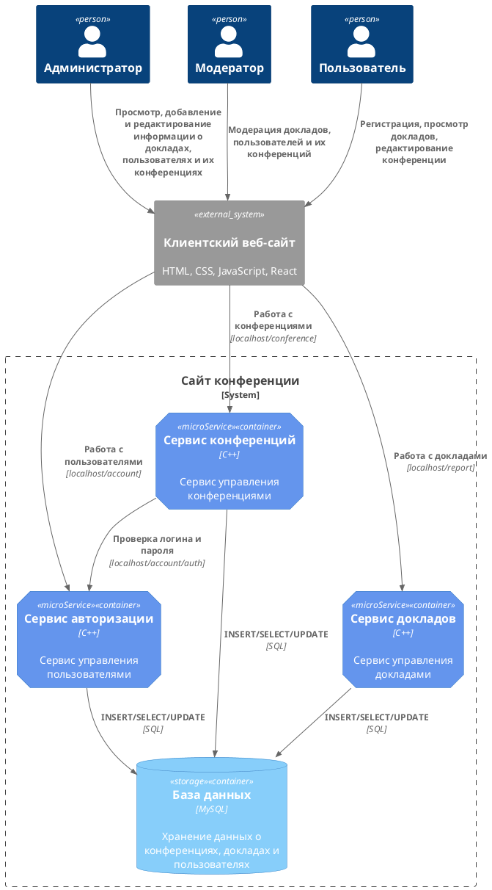

# Компонентная архитектура
<!-- Состав и взаимосвязи компонентов системы между собой и внешними системами с указанием протоколов, ключевые технологии, используемые для реализации компонентов.
Диаграмма контейнеров C4 и текстовое описание. 
-->
## Компонентная диаграмма

## Список компонентов  

### Сервис авторизации
**API**:
-	Создание нового пользователя
      - входные параметры: login, пароль, имя, фамилия, email, обращение (г-н/г-жа)
      - выходные параметры: отсутствуют
-	Поиск пользователя по логину
     - входные параметры:  login
     - выходные параметры: имя, фамилия, email, обращение (г-н/г-жа)
-	Поиск пользователя по маске имени и фамилии
     - входные параметры: маска фамилии, маска имени
     - выходные параметры: login, имя, фамилия, email, обращение (г-н/г-жа)

### Сервис докладов
**API**:
- Создание доклада
  - Входные параметры: тема доклада, категория, аннотация и автор
  - Выходыне параметры: идентификатор доклада
- Получение доклада
  - Входные параметры: идентификатор доклада, автор
  - Выходыне параметры: тема доклада, категория и аннотация
- Получение списка всех докладов
  - Входные параметры: отсутствуют
  - Выходные параметры: массив докладов, где для каждого указаны его идентификатор, тема, категория, аннотация и автор

### Сервис конференций
**API**:
- Создание конференции
  - Входные параметры: название конференции, тематика конференции
  - Выходные параметры: отсутствуют
- Получение информации о конференции
  - Входные параметры: название конференции
  - Выходные параметры: тематика конференции, доклады на конференции, авторы докладов
- Добавление доклада в конференцию
  - Входные параметры: тема доклада, автор, конференция, содержание доклада, идентификатор доклада
  - Выходные параметры: идентификатор доклада в сервисе конференций
- Получение списка докладов в конференции
  - Входные параметры: конференция
  - Выходные параметры: массив с докладами (идентификатор, тема доклада, автор, конференция, содержание доклада)